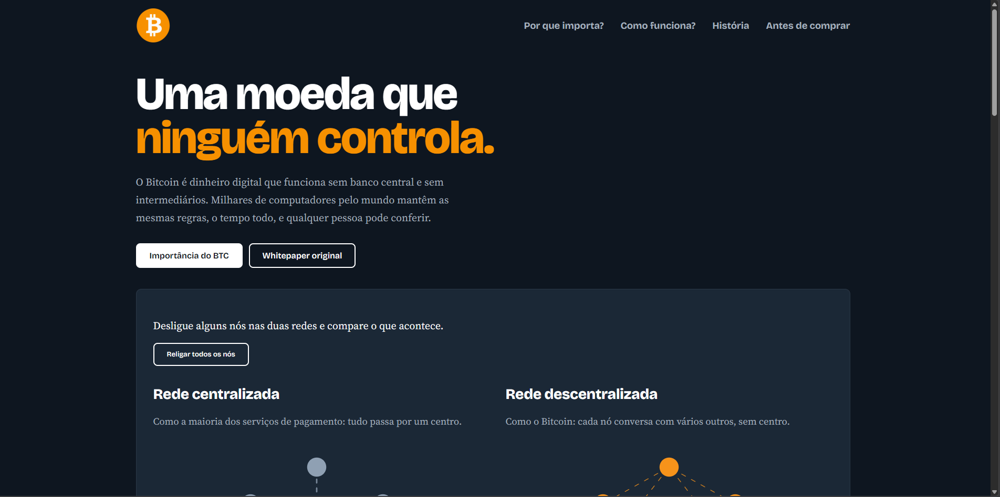
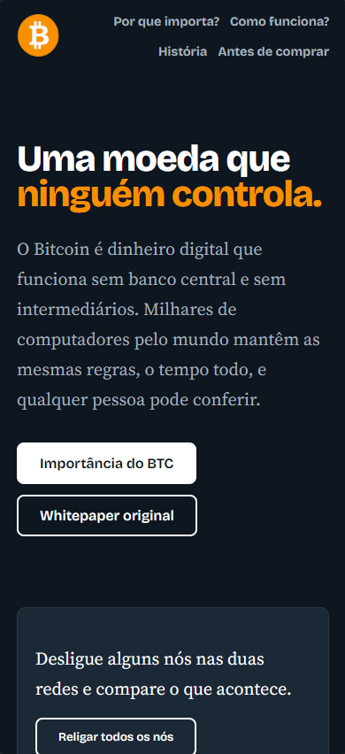

# 🪙 Info BTC
<br>

> Uma experiência web educativa sobre Bitcoin, descentralização e liberdade digital.

## 📌 Sobre o projeto

O **Info BTC** é um projeto desenvolvido com o objetivo de apresentar, de forma visual e acessível, conceitos relacionados ao funcionamento do Bitcoin e das redes descentralizadas.

A proposta é utilizar o desenvolvimento web não apenas para criar uma interface moderna, mas também para transformar um tema tecnológico complexo em uma experiência mais fácil de compreender.

O projeto foi desenvolvido utilizando **HTML, CSS e JavaScript**, com atenção à organização visual, responsividade e interações da página.

## 🎯 Objetivo

O principal objetivo do projeto é apresentar conceitos relacionados à descentralização e ao funcionamento de uma rede baseada em Bitcoin, estimulando o usuário a conhecer melhor o tema e refletir sobre o funcionamento das redes digitais.

## 🚀 Tecnologias utilizadas

* **HTML5** — estrutura e organização do conteúdo
* **CSS3** — estilização, layout, animações e responsividade
* **JavaScript** — interações e comportamentos da página
* **Git & GitHub** — versionamento e gerenciamento do projeto
* **GitHub Pages** — publicação do projeto na web

## ✨ Principais características

* Interface visual temática
* Layout responsivo
* Conteúdo educativo sobre Bitcoin
* Seções informativas
* Interações desenvolvidas com JavaScript
* Elementos visuais e animações
* Adaptação para diferentes tamanhos de tela

## 🧠 O que desenvolvi neste projeto

Durante o desenvolvimento do **Info BTC**, pude praticar e aprofundar conhecimentos importantes de desenvolvimento Front-End, principalmente:

* Estruturação de páginas com HTML semântico
* Organização e estilização de layouts utilizando CSS
* Responsividade para diferentes dispositivos
* Manipulação do DOM com JavaScript
* Criação de interações com eventos
* Organização de arquivos e recursos
* Utilização de Git para versionamento
* Publicação de um projeto utilizando GitHub Pages

## 📱 Responsividade
<br>

O projeto foi desenvolvido pensando em diferentes tamanhos de tela, buscando manter uma boa experiência de navegação tanto em computadores quanto em dispositivos menores.

## 🌐 Projeto online

### 🚀 [Acessar o Info BTC](https://mateusrabello22.github.io/Info-BTC/)

## 📂 Estrutura do projeto

```text
Info-BTC/
│
├── assets/
│   └── imagens e recursos do projeto
│
├── index.html
├── styles.css
├── script.js
└── README.md
```

## 📚 Contexto

Este projeto faz parte da minha jornada de aprendizado em **Desenvolvimento Front-End**.

Através dele, busquei unir prática de programação, construção de interfaces e apresentação de conteúdo em uma experiência web completa.

## 👨‍💻 Autor

**Mateus Rabelo**

Desenvolvedor Front-End em formação.

[](https://github.com/mateusrabello22)

---

⭐ Se você gostou do projeto, considere deixar uma estrela no repositório!
